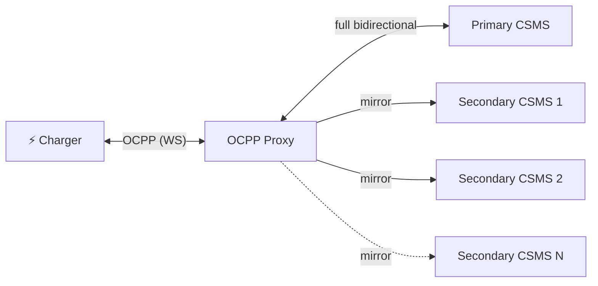

# joulo-ocpp-proxy

A lightweight **OCPP WebSocket proxy** that sits between your EV chargers and one or more CSMS backends. It forwards all traffic to a **primary CSMS** and mirrors it to **secondary backends** on a per-charger basis — perfect for monitoring, analytics, or migrating between platforms without reconfiguring your chargers.

Built with Node.js and TypeScript. Supports OCPP 1.6 and 2.0.1.

## How it works



| Direction | Primary CSMS | Secondary CSMS (×N) |
|---|---|---|
| Charger → CSMS | ✅ Forwarded | ✅ Mirrored, except responses |
| CSMS → Charger | ✅ Forwarded | ⚠️ Selected commands only |

The **primary CSMS** has full control — it can send any command back to the charger. Secondaries receive a mirrored copy of everything the charger initiates (boot notifications, meter values, start/stop transactions, etc.), but not the charger's *responses* — a `CALLRESULT` or `CALLERROR` answers a command only the primary sent, so mirroring it would hand a secondary a reply to a request it never made. Secondaries can be configured two ways, which combine freely:

- **Globally**, via `SECONDARY_CSMS_URLS` / `secondary_csms` — every charger is mirrored to those backends under its own ID.
- **Per charger**, via `charger_mappings` — each entry mirrors one `(charger_id, secondary_url)` pair and carries its own mapped charger ID, password, and `id_tag`, so the same backend can be wired to several chargers under different identities.

Most secondary responses are discarded, but a small set of read-only diagnostics (`TriggerMessage`, `GetConfiguration`) are forwarded to the charger so a secondary can still inspect charger state. Secondary connections are best-effort — if one fails, it never affects the charger or the primary link.

#### Secondary commands forwarded to the charger

| Command | Behaviour |
|---|---|
| `TriggerMessage` | Forwarded to charger; response returned to that secondary |
| `GetConfiguration` | Forwarded to charger; response returned to that secondary |
| Other known CSMS commands (`RemoteStartTransaction`, `Reset`, …) | Answered locally with `{status: "Rejected"}`; charger never sees them |
| Anything else | Refused locally with a `NotSupported` CallError |

### Secondary reliability

Because charger sessions can stay open for days or weeks, secondaries get a few extras so a brief network blip doesn't silently break your mirror for the rest of the session:

- **Auto-reconnect** — if a secondary disconnects, the proxy reconnects after 10s and keeps retrying until the charger session ends.
- **Keepalive ping** — the proxy sends a WebSocket ping to each secondary every 30s so idle connections aren't dropped by load balancers or CSMS timeouts.
- **Acknowledged delivery** — every mirrored frame goes through a per-secondary outbox and stays there until that secondary answers it. Unanswered frames are resent, and the outbox replays in order on reconnect.

A secondary failure never affects the charger or the primary link.

#### Acknowledged delivery

A socket can go half-open: `send()` reports success and the connection still looks open, but nothing reaches the peer and TCP doesn't report the failure for a long time. A frame written in that window looks delivered and would be lost silently. The only reliable signal is the secondary's own reply, so that is what the proxy waits for.

- A mirrored CALL is held until that secondary answers with a `CALLRESULT` or `CALLERROR`.
- **At most one CALL is in flight per secondary.** MeterValues can't be rewritten until the StartTransaction ahead of it has come back with that secondary's transaction ID, so the queue is strictly ordered.
- An unanswered CALL is resent after 120s. After two ack timeouts it's given up on, so one message a secondary never answers can't stall the mirror. A dropped connection doesn't count as a timeout — the frame simply goes out again on the new one.
- Up to 100 frames per secondary are held. If it fills, the oldest *waiting* frame is dropped (never the in-flight one, whose ack releases everything behind it).

**Your secondary must answer mirrored CALLs.** A secondary that ignores an action will see it resent once and then dropped. Every action is retried, including the non-transaction ones OCPP 1.6 tells a Charge Point not to resend — a mirror is not a Charge Point, and a dropped StatusNotification leaves that secondary's view of the connector stale until the next state change.

A resent StartTransaction may open a second transaction on that secondary, since OCPP 1.6 has the Central System accept every one and offers no deduplication. That's the deliberate trade: losing it is worse, because without the reply there is no transaction ID mapping and every MeterValues for the rest of the session carries the primary's ID instead.

## Quick start

### Home Assistant App

The easiest way to run the proxy on a Home Assistant installation.

**1. Add the repository**

In Home Assistant, go to **Settings → Apps → Install app**, then open the three-dot menu in the top right → **Repositories**, and add:

```
https://github.com/tomakava/joulo-ocpp-proxy
```

**2. Install**

After the repository loads, find **Joulo OCPP Proxy** in the store and click **Install**.

**3. Configure**

Go to the app's **Configuration** tab and fill in your settings:

```yaml
primary_csms_url: "wss://your-primary-csms.example.com/ocpp"
charger_mappings:
  - secondary_url: "wss://analytics.example.com/ocpp"
    charger_id: CHARGER-001
  - secondary_url: "wss://other-backend.example.com/ocpp"
    charger_id: CHARGER-001
    mapped_charger_id: ext-CHARGER-001
    password: secret123
    id_tag: HARDCODED-TAG
log_level: info
```

Only `primary_csms_url` is required. Each entry in `charger_mappings` enables mirroring for one `(charger_id, secondary_url)` pair; `mapped_charger_id`, `password`, and `id_tag` are optional overrides for that secondary. Chargers without any mapping go to the primary only.

**4. Start**

Click **Start**. The proxy will listen on port 9000. Enable **Start on boot** and **Watchdog** on the Info tab so it restarts automatically.

**5. Point your chargers at the proxy**

Change each charger's OCPP backend URL from the primary CSMS to the proxy's address:

```
Before: wss://your-csms.example.com/ocpp/CHARGER-001
After:  ws://<homeassistant-ip>:9000/CHARGER-001
```

---

### Using Docker (recommended)

A pre-built image is published automatically to GitHub Container Registry on every push to `main`.

```bash
docker run -d \
  -p 9000:9000 \
  -e PRIMARY_CSMS_URL=wss://your-primary-csms.example.com/ocpp \
  -v $(pwd)/data:/data \
  ghcr.io/joulo-nl/joulo-ocpp-proxy:main
```

Global mirrors can be set with `SECONDARY_CSMS_URLS`. Per-charger mirroring is configured via `charger_mappings` in a JSON config file (see below) — that part has no env-var equivalent. Mounting `/data` keeps transaction ID mappings across restarts.

### Using Docker Compose

```bash
git clone https://github.com/joulo-nl/joulo-ocpp-proxy.git
cd joulo-ocpp-proxy
cp .env.example .env
# Edit .env with your CSMS URLs
mkdir -p data
# The container runs as the node user (UID 1000) — make data/ writable:
sudo chown -R 1000:1000 data
docker compose up -d
```

`./data` is mounted at `/data`, where the proxy keeps `state.json` (see
[State persistence](#state-persistence)).

To use a JSON config file instead of `.env`, put it at `data/config.json` and
uncomment the `environment` block in `docker-compose.yml`:

```bash
cp config.example.json data/config.json
```

### From source

```bash
git clone https://github.com/joulo-nl/joulo-ocpp-proxy.git
cd joulo-ocpp-proxy
npm install
npm run build
PRIMARY_CSMS_URL=wss://your-csms.example.com/ocpp npm start
```

## Configuration

### Config file (recommended)

Create a `config.json` file (see `config.example.json`) and point the container at it with `CONFIG_FILE`:

```json
{
  "primary_csms_url": "wss://your-primary-csms.example.com/ocpp",
  "charger_mappings": [
    {
      "secondary_url": "wss://analytics.example.com/ocpp",
      "charger_id": "CHARGER-001"
    },
    {
      "secondary_url": "wss://other-backend.example.com/ocpp",
      "charger_id": "CHARGER-001",
      "mapped_charger_id": "ext-CHARGER-001",
      "password": "secret123",
      "id_tag": "HARDCODED-TAG"
    }
  ],
  "log_level": "info",
  "log_debug_message_max_length": 120
}
```

Each config file option maps to the environment variable of the same name in
upper case (`log_level` → `LOG_LEVEL`). Set
`log_debug_message_max_length` to `""` to disable truncation entirely — the
Home Assistant options schema only accepts a positive integer, so disabling
truncation works from a hand-written config file or `LOG_DEBUG_MESSAGE_MAX_LENGTH`,
not from the add-on's Configuration tab.

An option of the wrong type is reported in the log and ignored, so a typo in the
config file falls back to the default instead of stopping the proxy. A missing
`primary_csms_url` is fatal — the proxy logs one line saying so and exits.

There are two ways to configure secondaries, and they can be combined:

- `secondary_csms` / `SECONDARY_CSMS_URLS` — global mirrors that receive traffic
  from **every** charger, under the charger's own ID.
- `charger_mappings` — mirrors wired to **one** charger. Each entry declares a
  `(charger_id, secondary_url)` pair; `mapped_charger_id`, `password`, and
  `id_tag` are per-pair overrides for backends that expect a different charger
  identity than the primary. There is no env-var equivalent.

A charger with no global mirrors and no mappings is sent only to the primary.

#### Protocol support for mapped secondaries

A mapping's URL and credentials (`mapped_charger_id` in the connect URL,
`password` for HTTP Basic auth) apply to any OCPP version the proxy accepts.

The **payload rewrites are OCPP 1.6 only** — they match 1.6 action names and
payload keys:

| Rewrite | 1.6 | 2.0 / 2.0.1 |
|---|---|---|
| Charger identity in `BootNotification` | `chargePointSerialNumber` is replaced | Not applied — 2.0.1 sends `chargingStation.serialNumber` |
| `id_tag` substitution in `StartTransaction` | `idTag` is replaced | Not applied — 2.0.1 authorizes with `idToken` in `TransactionEvent` |
| Transaction ID translation | `transactionId` in `MeterValues` / `StopTransaction` is remapped | Not needed — in 2.0.1 the charging station generates the transaction ID, so it is already the same for every CSMS |

So on a 2.0/2.0.1 session a mapped secondary is reached under its mapped ID with
its own credentials, but sees the charger's payloads unmodified. Setting
`id_tag` or `mapped_charger_id` expecting the payload rewrites will have no
effect there.

### Environment variables

| Variable | Required | Default | Description |
|---|---|---|---|
| `CONFIG_FILE` | No | `/data/options.json` | Path to the JSON config file |
| `STATE_FILE` | No | `/data/state.json` | Path to the persisted transaction ID mappings |
| `PORT` | No | `9000` | Port the proxy listens on |
| `PRIMARY_CSMS_URL` | No* | — | WebSocket URL of your primary CSMS |
| `SECONDARY_CSMS_URLS` | No | — | Comma-separated list of secondary CSMS URLs mirrored for every charger |
| `PRIMARY_CSMS_APPEND_CHARGE_POINT_ID` | No | `true` | `true`/`false`; when `true`, append incoming charge point ID to `PRIMARY_CSMS_URL` |
| `SECONDARY_CSMS_APPEND_CHARGE_POINT_ID` | No | `true` | `true`/`false`; when `true`, append the charge point ID to secondary URLs (the `mapped_charger_id` for mapped secondaries) |
| `LOG_LEVEL` | No | `info` | `debug`, `info`, `warn`, or `error` |
| `LOG_DEBUG_MESSAGE_MAX_LENGTH` | No | `120` | Max char length for debug payload summaries. Leave empty to disable truncation |

\* Required if not set in the config file. Environment variables take precedence over the config file. Secondary mirroring requires the JSON config file — there is no env-var equivalent for `charger_mappings`.

### State persistence

Because OCPP 1.6 transaction IDs are assigned per CSMS, the proxy keeps a map of
primary → secondary transaction IDs for each charger. That map is written to
`/data/state.json` (override with `STATE_FILE`) so a proxy restart or a charger
reconnect in the middle of a transaction doesn't leave later `MeterValues` and
`StopTransaction` carrying a transaction ID the secondary never issued.

- Writes are debounced (500 ms) and atomic (write to `.tmp`, then rename).
- Entries older than 7 days are dropped at startup.
- Persistence is best-effort: if `/data` isn't writable the proxy logs one
  warning and keeps running with in-memory mappings only.

Mount a writable volume at `/data` to keep the file across restarts — the Home
Assistant add-on does this for you.

## Charger setup

Point your charger's OCPP backend URL to the proxy instead of the CSMS directly:

```
Before:  wss://your-csms.example.com/ocpp/CHARGER-001
After:   ws://proxy-host:9000/CHARGER-001
```

The proxy can append the charge point ID from the incoming URL to each upstream CSMS URL. For a mapped secondary it appends that mapping's `mapped_charger_id` instead (falling back to the charger's own ID when no override is set).

By default, both primary and secondary URLs append the charge point ID. For CSMS endpoints that use a fixed endpoint URL (for example `wss://fixed-csms.example.com/XXXXXXXX`), set the corresponding toggle to `false`.

If your charger connects to `ws://proxy:9000/CHARGER-001` and appending is enabled, the proxy connects to:

- Primary: `wss://your-primary-csms.example.com/ocpp/CHARGER-001`
- Each matching secondary: `<secondary_url>/<mapped_charger_id or CHARGER-001>`

With `PRIMARY_CSMS_APPEND_CHARGE_POINT_ID=false` and `SECONDARY_CSMS_APPEND_CHARGE_POINT_ID=true`, this becomes:

- `wss://fixed-csms.example.com/XXXXXXXX`
- `wss://analytics.example.com/ocpp/CHARGER-001`

### URL patterns

The proxy accepts any of these URL patterns and extracts the last path segment as the charge point ID:

```
ws://proxy:9000/CHARGER-001
ws://proxy:9000/ocpp/CHARGER-001
ws://proxy:9000/ws/CHARGER-001
```

### Authentication

If the charger sends HTTP Basic Auth credentials, the proxy forwards the `Authorization` header to all upstream CSMS backends as-is.

### Sub-protocol negotiation

The proxy negotiates OCPP sub-protocols (`ocpp1.6`, `ocpp2.0`, `ocpp2.0.1`) between the charger and the upstream backends automatically.

## Use cases

### Multi-backend monitoring

Run your chargers against your primary platform while mirroring data to your own analytics or energy management system.

### Platform migration

During a CSMS migration, mirror traffic to the new platform and verify it processes messages correctly before switching over.

### Development & debugging

Mirror production charger traffic to a local development CSMS for testing without affecting the live system.

### Compliance & auditing

Send a copy of all OCPP messages to an audit system for regulatory compliance.

## Logging

Logs are structured JSON written to stdout/stderr:

```json lines
{"time":"2026-04-07T10:00:00.000Z","level":"info","tag":"proxy","msg":"proxy listening","port":9000,"primary":"wss://csms.example.com/ocpp","secondaries":[]}
{"time":"2026-04-07T10:00:01.000Z","level":"info","tag":"CHARGER-001","msg":"session started","primary":"wss://csms.example.com/ocpp","secondaries":[],"protocol":"ocpp1.6"}
{"time":"2026-04-07T10:00:01.500Z","level":"debug","tag":"CHARGER-001","msg":"charger → proxy","message":"[OCPP CALL] (abc123): [2, \"abc123\", \"BootNotification\", {\"chargePointVendor\":\"Acme\"}]"}
```

Set `LOG_LEVEL=debug` for OCPP payload summaries (including message-type-prefixed payloads for troubleshooting).
Set `LOG_DEBUG_MESSAGE_MAX_LENGTH` to a positive integer to cap logged `message` values in debug output.
Leave it unset for the default, or set it empty to disable truncation.

## Building the Docker image

```bash
docker build -t joulo-ocpp-proxy .
```

The image uses a multi-stage build. The Home Assistant add-on runs it as root (per the add-on contract); the bundled `docker-compose.yml` sets `user: node` so plain Docker deployments run unprivileged.

## Contributing

Contributions are welcome! Please open an issue first to discuss what you'd like to change.

1. Fork the repository
2. Create a feature branch (`git checkout -b feature/my-feature`)
3. Commit your changes
4. Push to your branch
5. Open a Pull Request

## About

This project is maintained by [Joulo](https://joulo.nl) — a Dutch platform that helps EV owners earn rewards for charging at home with green energy. We built this proxy to solve a real-world need: connecting chargers to multiple backends without vendor lock-in.

If you're interested in smart EV charging and renewable energy, check us out at [joulo.nl](https://joulo.nl).

## License

[MIT](LICENSE) — use it however you like.
